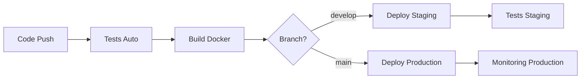

# Configuration CI/CD Complète - AlphaBeta808Trading 🚀

## 🎯 Résumé de la Configuration

Votre système CI/CD est maintenant configuré avec :

### ✅ Pipeline automatisé GitHub Actions
- **Tests automatiques** sur chaque push/PR
- **Build et push Docker** vers Scaleway Container Registry
- **Déploiement automatique** staging (develop) et production (main)
- **Gestion sécurisée des secrets** via GitHub Secrets

### ✅ Gestion des secrets
- Script automatisé pour configurer GitHub Secrets
- Secrets séparés par environnement (staging/production)
- Configuration sécurisée des clés API Binance

### ✅ Déploiement Kubernetes
- Namespaces séparés pour staging et production
- ConfigMaps avec configuration monitoring
- Scripts de déploiement local automatisés
- Validation de l'état de santé

## 📁 Nouveaux Fichiers Créés

```
.github/
├── setup-secrets.sh           # Configuration automatique des secrets GitHub
├── validate-setup.sh          # Validation de la configuration
├── CI-CD-SETUP-GUIDE.md       # Guide détaillé
└── workflows/ci-cd.yml        # Pipeline amélioré

k8s/
├── deploy-with-secrets.sh     # Déploiement local automatisé
├── secrets.yaml               # Template mis à jour
└── configmap.yaml             # Configuration monitoring ajoutée
```

## 🚀 Étapes pour Démarrer

### 1. Configuration des Secrets (REQUIS)
```bash
cd .github/
./setup-secrets.sh
```

### 2. Validation de la Configuration
```bash
./validate-setup.sh
```

### 3. Premier Déploiement
```bash
# Test en staging
git checkout develop
git push origin develop

# Production (après validation staging)
git checkout main
git merge develop
git push origin main
```

### 4. Monitoring
```bash
# Voir les logs
kubectl logs -f deployment/trading-bot -n alphabeta808-trading-staging

# Accéder à l'interface web
kubectl port-forward svc/trading-web-service 8080:80 -n alphabeta808-trading-staging
```

## 🔑 Secrets Configurés

### Secrets Binance
- `BINANCE_API_KEY_STAGING` - Clés testnet pour staging
- `BINANCE_API_SECRET_STAGING`
- `BINANCE_API_KEY_PRODUCTION` - Clés mainnet pour production
- `BINANCE_API_SECRET_PRODUCTION`

### Secrets Infrastructure
- `SCW_SECRET_KEY` - Scaleway Container Registry
- `KUBECONFIG_STAGING` - Configuration Kubernetes staging
- `KUBECONFIG_PRODUCTION` - Configuration Kubernetes production

### Secrets Application
- `WEBHOOK_SECRET` - Sécurité webhooks
- `WEB_ADMIN_USER` / `WEB_ADMIN_PASSWORD` - Interface admin
- `SMTP_PASSWORD` - Notifications email
- `DATABASE_URL_*` - Base de données (optionnel)

## 🏗️ Environnements

### Staging (branche develop)
- **Namespace**: `alphabeta808-trading-staging`
- **Binance**: Testnet (argent virtuel) 💰
- **URL**: Port-forward local
- **Auto-déploiement**: ✅

### Production (branche main)
- **Namespace**: `alphabeta808-trading`
- **Binance**: Mainnet (argent réel!) ⚠️
- **URL**: Ingress configuré
- **Auto-déploiement**: ✅
- **Monitoring**: Complet (HPA, PDB)

## 🛠️ Scripts Utiles

### Configuration et Validation
```bash
# Configurer tous les secrets GitHub
.github/setup-secrets.sh

# Valider la configuration complète
.github/validate-setup.sh
```

### Déploiement Local
```bash
# Déploiement staging local
k8s/deploy-with-secrets.sh staging

# Déploiement production local (ATTENTION!)
k8s/deploy-with-secrets.sh production
```

### Monitoring
```bash
# Statut des pods
kubectl get pods -n alphabeta808-trading

# Logs en temps réel
kubectl logs -f deployment/trading-bot -n alphabeta808-trading

# Interface web
kubectl port-forward svc/trading-web-service 8080:80 -n alphabeta808-trading
```

## 🔒 Sécurité

### ✅ Bonnes Pratiques Configurées
- Secrets séparés par environnement
- Testnet pour staging, mainnet pour production
- Restriction des permissions Kubernetes
- Validation automatique des déploiements

### ⚠️ Actions Importantes
1. **Configurez les restrictions IP** sur vos clés Binance
2. **Limitez les permissions** des clés API (Trading + Reading uniquement)
3. **Surveillez les logs** régulièrement
4. **Testez TOUJOURS en staging** avant production

## 🎯 Workflow de Déploiement



## 📊 Monitoring Configuré

### Métriques Surveillées
- CPU/Mémoire/Disque
- Temps de réponse API
- Taux de succès des trades
- Erreurs consécutives
- Exposition du portefeuille

### Alertes Email
- Problèmes critiques : Immédiat
- Erreurs : Immédiat  
- Warnings : Résumé quotidien
- Info : Résumé hebdomadaire

### Limites de Trading
- Position max : 1000 USDT
- Trades journaliers max : 50
- Exposition max : 10000 USDT
- Stop loss : 5%
- Take profit : 10%

## 🆘 Dépannage Rapide

### Problème: Déploiement échoue
```bash
# Vérifier les événements Kubernetes
kubectl get events -n alphabeta808-trading --sort-by='.lastTimestamp'

# Vérifier les secrets
kubectl get secrets -n alphabeta808-trading
```

### Problème: Bot ne démarre pas
```bash
# Logs détaillés
kubectl logs deployment/trading-bot -n alphabeta808-trading --previous

# Vérifier la configuration
kubectl get configmap trading-config -n alphabeta808-trading -o yaml
```

### Problème: Erreurs API Binance
- Vérifiez les clés API (testnet vs mainnet)
- Vérifiez les restrictions IP
- Vérifiez les permissions des clés

## 📞 Support

1. **Consultez** les logs Kubernetes et GitHub Actions
2. **Utilisez** le script de validation : `./validate-setup.sh`
3. **Référez-vous** au guide détaillé : `.github/CI-CD-SETUP-GUIDE.md`
4. **Vérifiez** la documentation Binance API

## 🎉 Félicitations !

Votre bot de trading AlphaBeta808 est maintenant configuré avec :
- ✅ CI/CD automatisé
- ✅ Gestion sécurisée des secrets
- ✅ Déploiements multi-environnements
- ✅ Monitoring complet
- ✅ Scripts d'automatisation

**Prêt pour le trading automatisé ! 🤖💹**

---
**⚠️ RAPPEL** : Testez toujours en staging avant la production !
