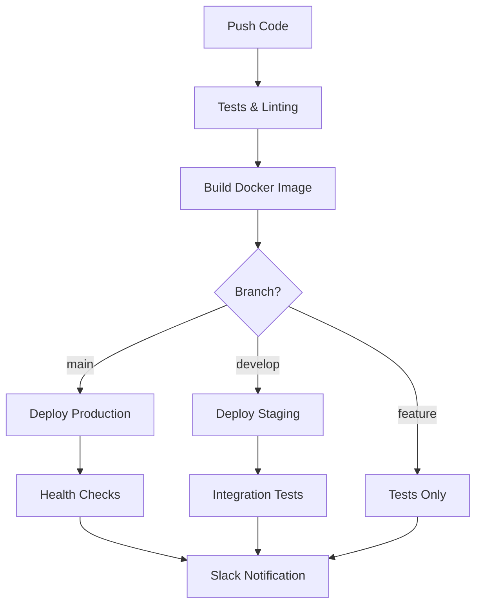

# 🚀 Pipeline CI/CD - AlphaBeta808 Trading Bot

Ce répertoire contient les workflows GitHub Actions pour automatiser les tests, le build et le déploiement du bot de trading AlphaBeta808.

## 📋 Vue d'ensemble

Le pipeline CI/CD est composé de trois workflows principaux :

### 1. `ci-cd.yml` - Pipeline Principal
- **Déclencheurs** : Push sur `main`/`develop`, Pull Requests, Releases
- **Fonctionnalités** :
  - Tests Python complets (pytest, flake8, black)
  - Vérifications système automatiques
  - Build et push d'images Docker vers Scaleway Container Registry
  - Déploiement automatique sur Kubernetes (branch `main`)
  - Notifications Slack

### 2. `staging.yml` - Déploiement Staging
- **Déclencheurs** : Push sur `develop`, déclenchement manuel
- **Fonctionnalités** :
  - Tests rapides de validation
  - Build d'images avec tags staging
  - Déploiement sur environnement de staging
  - Tests d'intégration automatiques
  - Tests de performance de base
  - Nettoyage automatique (optionnel)

### 3. `release.yml` - Release et Production
- **Déclencheurs** : Déclenchement manuel, releases GitHub
- **Fonctionnalités** :
  - Tests de sécurité complets (safety, bandit)
  - Scan de vulnérabilités
  - Gestion automatique des versions sémantiques
  - Déploiement de production avec rolling updates
  - Rollback automatique en cas d'échec
  - Création automatique de release notes

## 🔧 Configuration Requise

### Secrets GitHub

Configurez les secrets suivants dans les paramètres du repository :

#### Container Registry
```
SCW_SECRET_KEY: Clé API Scaleway pour Container Registry
```

#### Kubernetes
```
KUBECONFIG: Configuration kubectl pour production (base64)
KUBECONFIG_STAGING: Configuration kubectl pour staging (base64)
KUBECONFIG_PROD: Configuration kubectl pour production (base64)
```

#### Notifications
```
SLACK_WEBHOOK_URL: URL webhook Slack pour notifications (optionnel)
```

### Variables d'Environnement

Les variables suivantes sont configurées dans les workflows :

```yaml
env:
  REGISTRY: rg.fr-par.scw.cloud/namespace-ecstatic-einstein
  IMAGE_NAME: alphabeta808-trading-bot
```

## 🏗️ Architecture du Pipeline



## 🚦 Utilisation

### Déploiement Automatique

1. **Staging** : Push sur `develop` → Déploiement automatique sur staging
2. **Production** : Push sur `main` → Déploiement automatique sur production

### Déploiement Manuel

#### Staging avec Tests
```bash
# Via GitHub Actions interface
Workflow: "Staging Deployment"
Branch: develop
Environment: staging
```

#### Release de Production
```bash
# Via GitHub Actions interface  
Workflow: "Release and Production"
Release Type: patch/minor/major/hotfix
Environment: production
```

### Gestion des Versions

Les versions suivent la convention sémantique :
- `major` : Changements breaking (v1.0.0 → v2.0.0)
- `minor` : Nouvelles fonctionnalités (v1.0.0 → v1.1.0)
- `patch` : Bug fixes (v1.0.0 → v1.0.1)
- `hotfix` : Correctifs urgents (création d'une pre-release)

## 🎯 Environnements

### Development
- **Namespace** : `alphabeta808-development`
- **Image Tag** : `develop-{sha}`
- **Testnet** : Activé
- **Auto-scaling** : Désactivé

### Staging
- **Namespace** : `alphabeta808-staging`
- **Image Tag** : `staging-{sha}`, `staging-latest`
- **Testnet** : Activé
- **URL** : https://staging.alphabeta808.com
- **Auto-cleanup** : Optionnel pour environnements de test

### Production
- **Namespace** : `alphabeta808-trading`
- **Image Tag** : `{version}`, `latest`, `stable`
- **Testnet** : Désactivé (Live Trading)
- **URL** : https://trading.alphabeta808.com
- **Rolling Updates** : Activé
- **Auto-rollback** : En cas d'échec

## 🛡️ Sécurité

### Scans de Sécurité Automatiques
- **Safety** : Vérification des vulnérabilités dans les dépendances Python
- **Bandit** : Analyse statique de sécurité du code Python
- **Container Scanning** : Scan des images Docker (via registry)

### Bonnes Pratiques Implémentées
- Utilisateur non-root dans les conteneurs
- Secrets Kubernetes pour données sensibles
- RBAC avec permissions minimales
- Health checks et liveness probes
- Resource limits et requests

## 📊 Monitoring et Logs

### Health Checks Automatiques
```bash
# Tests de santé après déploiement
curl -f http://localhost:8080/api/status
curl -f http://localhost:8080/api/performance
```

### Accès aux Logs
```bash
# Logs du bot de trading
kubectl logs -f deployment/trading-bot -n alphabeta808-trading

# Logs de l'interface web
kubectl logs -f deployment/trading-web-interface -n alphabeta808-trading
```

### Métriques
- Déploiements réussis/échoués
- Temps de build et de déploiement
- Coverage des tests
- Statut des health checks

## 🔄 Rollback

### Rollback Automatique
Le pipeline effectue un rollback automatique si :
- Les health checks échouent après déploiement
- Le déploiement ne se termine pas dans les temps
- Les tests post-déploiement échouent

### Rollback Manuel
```bash
# Via kubectl
kubectl rollout undo deployment/trading-bot -n alphabeta808-trading
kubectl rollout undo deployment/trading-web-interface -n alphabeta808-trading

# Via le script de gestion
./k8s/manage.sh rollback
```

## 🚨 Troubleshooting

### Échec de Tests
```bash
# Vérifier les logs du job
gh run view <run-id>

# Relancer les tests localement
python -m pytest tests/ -v
python system_check.py
```

### Échec de Build
```bash
# Vérifier l'image Docker localement
docker build -t test-image .
docker run --rm test-image python --version
```

### Échec de Déploiement
```bash
# Vérifier l'état des pods
kubectl get pods -n alphabeta808-trading

# Vérifier les événements
kubectl get events -n alphabeta808-trading

# Vérifier les logs
kubectl logs deployment/trading-bot -n alphabeta808-trading
```

## 📞 Support

- **Issues** : Utiliser GitHub Issues pour reporter des problèmes
- **Monitoring** : Vérifier les workflows dans l'onglet Actions
- **Notifications** : Canal Slack `#deployments` et `#releases`

## 🔄 Évolutions Futures

### Améliorations Prévues
- [ ] Tests de charge automatiques
- [ ] Canary deployments
- [ ] Multi-region deployments
- [ ] Monitoring Prometheus/Grafana intégré
- [ ] Tests de chaos engineering
- [ ] Blue/Green deployments

### Configuration Avancée
- [ ] Environnements éphémères pour PR
- [ ] Cache multi-layer pour builds Docker
- [ ] Artefacts de build persistants
- [ ] Intégration SIEM pour sécurité
