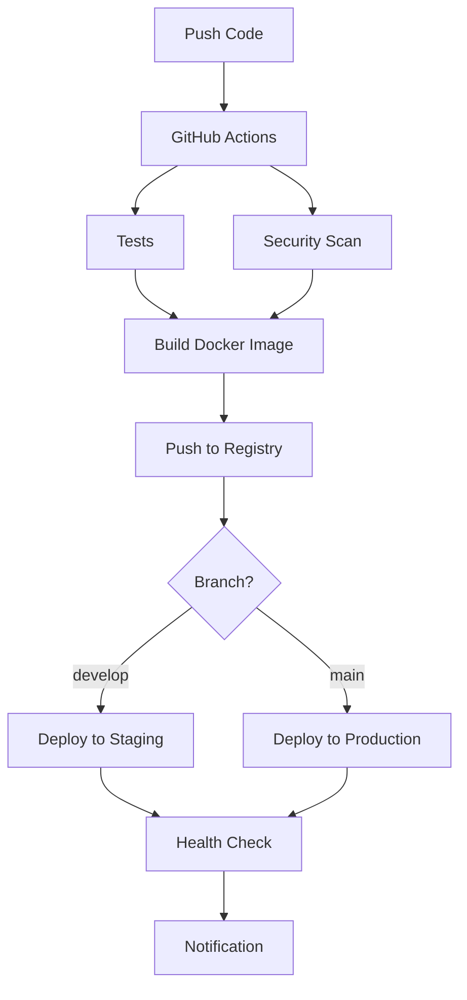

# Guide de Déploiement CI/CD - AlphaBeta808 Trading Bot

Ce guide vous explique comment configurer et utiliser le pipeline CI/CD pour déployer automatiquement votre bot de trading sur Kubernetes via GitHub Actions.

## 🏗️ Architecture du Pipeline



## 🔧 Configuration Initiale

### 1. Prérequis

- Repository GitHub configuré
- Cluster Kubernetes accessible
- Compte Scaleway Container Registry
- Clés API Binance (testnet et mainnet)

### 2. Configuration des GitHub Secrets

Utilisez le script automatisé pour configurer tous les secrets :

```bash
./scripts/setup-github-secrets.sh
```

Ou configurez manuellement dans GitHub Settings > Secrets and variables > Actions :

#### Secrets Binance
- `BINANCE_API_KEY_STAGING` - Clé API Binance pour l'environnement de test
- `BINANCE_API_SECRET_STAGING` - Secret API Binance pour l'environnement de test
- `BINANCE_API_KEY_PRODUCTION` - Clé API Binance pour la production
- `BINANCE_API_SECRET_PRODUCTION` - Secret API Binance pour la production

#### Secrets Infrastructure
- `SCW_SECRET_KEY` - Clé secrète Scaleway pour le registry
- `KUBECONFIG_STAGING` - Configuration Kubernetes pour staging (base64)
- `KUBECONFIG_PRODUCTION` - Configuration Kubernetes pour production (base64)
- `WEBHOOK_SECRET` - Secret pour les webhooks (généré aléatoirement)

### 3. Configuration des Environnements GitHub

1. Allez dans votre repository GitHub
2. Settings > Environments
3. Créez deux environnements :
   - `staging` - Pour les déploiements de test
   - `production` - Pour les déploiements en production

4. Configurez des règles de protection pour `production` :
   - Required reviewers (recommandé)
   - Wait timer (optionnel)
   - Deployment branches (main uniquement)

## 🚀 Flux de Déploiement

### Déploiement Automatique

Le pipeline se déclenche automatiquement sur :

1. **Push sur `develop`** → Déploiement en staging
2. **Push sur `main`** → Déploiement en production
3. **Pull Request** → Tests uniquement

### Déploiement Manuel

Vous pouvez déclencher manuellement un déploiement :

1. Allez dans l'onglet "Actions" de votre repository
2. Sélectionnez "CI/CD Pipeline - AlphaBeta808 Trading Bot"
3. Cliquez sur "Run workflow"
4. Choisissez la branche à déployer

## 🧪 Étapes du Pipeline

### 1. Tests et Vérifications
- Tests unitaires avec pytest
- Vérifications de formatage du code
- Scan de sécurité
- Vérification des dépendances

### 2. Build et Push
- Construction de l'image Docker
- Tag automatique basé sur la branche/commit
- Push vers Scaleway Container Registry
- Cache optimisé pour des builds rapides

### 3. Déploiement
- Création/mise à jour des secrets Kubernetes
- Application des manifests K8s
- Attente de la disponibilité des pods
- Vérifications de santé post-déploiement

## 🔐 Sécurité

### Bonnes Pratiques

1. **Rotation des Clés** :
   ```bash
   # Mettre à jour un secret
   gh secret set BINANCE_API_KEY_PRODUCTION --body "nouvelle_clé"
   ```

2. **Monitoring des Secrets** :
   - Surveillez l'activité de vos clés API
   - Activez les alertes Binance
   - Auditez régulièrement les accès

3. **Environnements Séparés** :
   - Testnet pour staging
   - Mainnet pour production uniquement
   - Configurations distinctes

### Configuration Binance Sécurisée

```bash
# Exemple de configuration de clés avec restrictions IP
# (à faire dans l'interface Binance)
- Read Info: ✅
- Spot & Margin Trading: ✅ (minimal requis)
- Futures: ❌ (sauf si nécessaire)
- IP Restriction: ✅ (IP de vos workers GitHub)
```

## 📊 Monitoring et Logs

### Accès aux Logs

```bash
# Logs du pipeline GitHub Actions
gh run list --workflow=ci-cd.yml

# Logs Kubernetes
kubectl logs -f deployment/trading-bot -n alphabeta808-trading

# Logs staging
kubectl logs -f deployment/trading-bot -n alphabeta808-trading-staging
```

### Métriques de Déploiement

Le pipeline collecte automatiquement :
- Temps de build
- Taille des images
- Durée de déploiement
- Taux de succès/échec

## 🔧 Dépannage

### Erreurs Communes

#### 1. Échec d'authentification Registry
```bash
Error: failed to authorize: authentication required
```
**Solution** : Vérifiez le secret `SCW_SECRET_KEY`

#### 2. Échec de connexion Kubernetes
```bash
Error: error loading config file "/home/runner/.kube/config"
```
**Solution** : Vérifiez les secrets `KUBECONFIG_*` (doivent être en base64)

#### 3. Échec de déploiement des secrets
```bash
Error: secrets "trading-secrets" already exists
```
**Solution** : Normal, les secrets sont mis à jour automatiquement

#### 4. Pods en erreur
```bash
# Diagnostiquer les problèmes de pods
kubectl describe pod -l app=trading-bot -n alphabeta808-trading
kubectl logs -l app=trading-bot -n alphabeta808-trading --previous
```

### Debug Mode

Pour activer le mode debug dans le pipeline :

```yaml
# Dans .github/workflows/ci-cd.yml
env:
  ACTIONS_STEP_DEBUG: true
  ACTIONS_RUNNER_DEBUG: true
```

## 📝 Maintenance

### Mise à Jour du Pipeline

1. **Modifier le workflow** :
   ```bash
   git checkout -b update-pipeline
   # Modifier .github/workflows/ci-cd.yml
   git commit -m "Update CI/CD pipeline"
   git push origin update-pipeline
   ```

2. **Tester les changements** :
   - Créer une PR pour tester
   - Vérifier les logs d'exécution
   - Merger après validation

### Rotation des Secrets

```bash
# Script de rotation automatique
./scripts/rotate-secrets.sh

# Ou manuellement
gh secret set BINANCE_API_KEY_PRODUCTION --body "$(cat new-api-key.txt)"
```

### Nettoyage

```bash
# Nettoyer les anciennes images
docker system prune -f

# Nettoyer les anciens déploiements
kubectl delete replicaset --all -n alphabeta808-trading
```

## 📚 Ressources Supplémentaires

### Documentation
- [GitHub Actions Documentation](https://docs.github.com/en/actions)
- [Kubernetes Deployments](https://kubernetes.io/docs/concepts/workloads/controllers/deployment/)
- [Binance API Documentation](https://binance-docs.github.io/apidocs/)

### Outils Utiles
- `gh` - GitHub CLI
- `kubectl` - Kubernetes CLI
- `docker` - Gestion des conteneurs

### Support
- Issues GitHub du projet
- Documentation Kubernetes
- Support Binance pour les problèmes d'API

---

## ✅ Checklist de Mise en Production

- [ ] Secrets GitHub configurés
- [ ] Environnements GitHub créés avec protection
- [ ] Clusters Kubernetes accessibles
- [ ] Registry Scaleway configuré
- [ ] Clés Binance avec restrictions appropriées
- [ ] Tests pipeline en staging
- [ ] Monitoring et alertes configurés
- [ ] Procédures de rollback définies
- [ ] Documentation équipe mise à jour

---

*Ce guide est maintenu à jour avec les évolutions du pipeline. Pour toute question, consultez la documentation ou créez une issue.*
